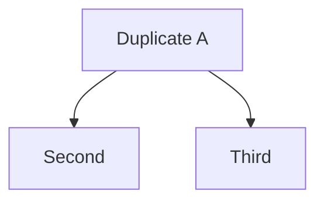
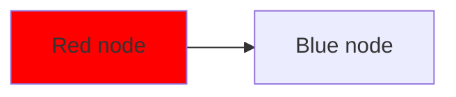
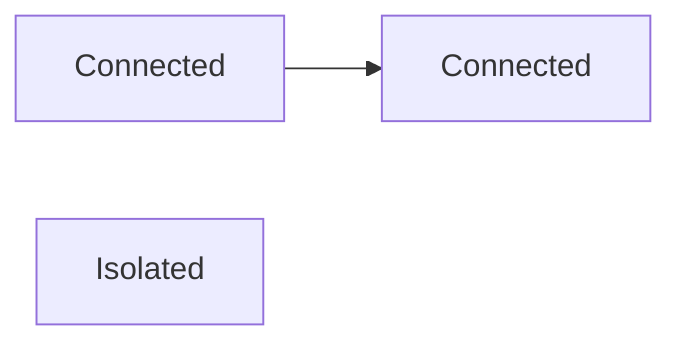

# Test Mermaid File

This is a test file with various issues.

## Test 1: Newline literal


## Test 2: Unquoted text with special chars

```mermaid
graph LR
    A[Function(foo)] --> B[Name: Value]
    B --> C[Data {key: value}]
```

## Test 3: Duplicate node



## Test 4: Undefined class



## Test 5: Invalid style


## Test 6: Isolated node



## Test 7: HTML tags


